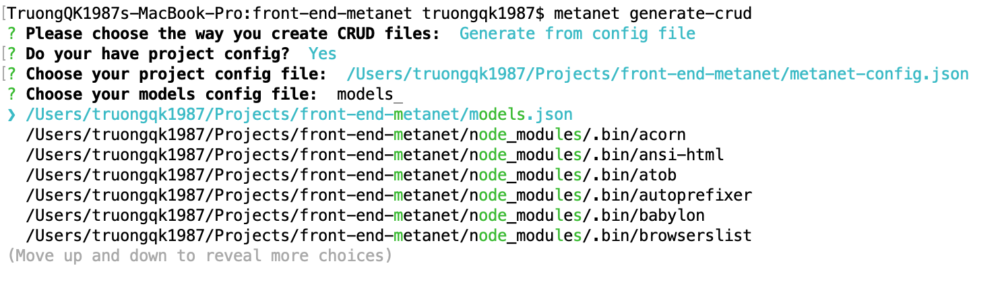

# Redux-saga-crud-generator

This is a code generator which help developer can make a crud for entity in redux-saga project easily

## Getting Started

1. Install it by typing: ```npm -i g redux-saga-crud-generator```
2. You open the terminal at the project root
3. Type the command: **metanet generate-crud**
4. Answer the questions
   - A small mentions: if you have your config for generator, please prepare it before run command
     - *<project-config.json>*: A json file to give the config for places which files were rendered
     - *<models.json>*: A json file for define list of entity and its container



### Prerequisites

You need a node.js version > 12

### project-config.json example
```
{
    "BASE_API": "",
    "EXTEND_TEMPLATE_FILE_MAP_INFO": {},
    "ENCODING": "",
    "EXTEND_REQUIRED_LIBS": [],

    "PROJECT_TEMPLATES_PATH": "",
    "PROJECT_SOURCE_PATH": "",
    "ROOT_CONTAINERS_PATH": ""
}
```

### models.json example
```
{
    "employee": {
        "attributes": {
            "id": "number",
            "title": "string",
            "age": "number"
        },
        "containers": [
            "Training", "Payment", "Location"
        ]
    },
    "department": {
        "attributes": {
            "id": "number",
            "address": "string"
        },
        "containers": ["Location"]
    },
    "book": {
        "attributes": {
            "id": "number",
            "title": "string"
        },
        "containers": ["Library"]
    }
}
```

## Authors

* **Quang Khải**: I am a front-end engineer of Metanet 

## License

This project is licensed under the MIT License - see the [LICENSE.md](LICENSE.md) file for details
